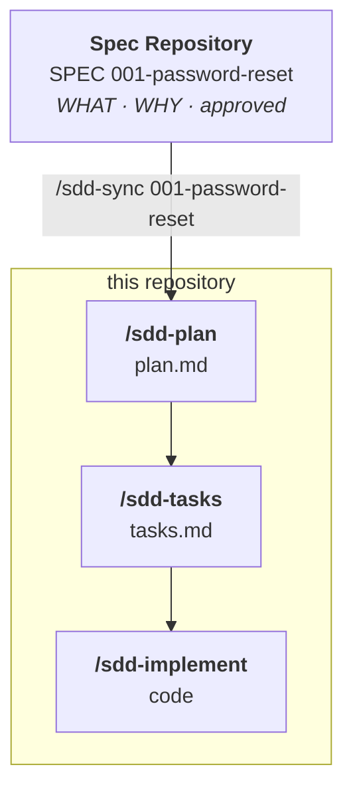
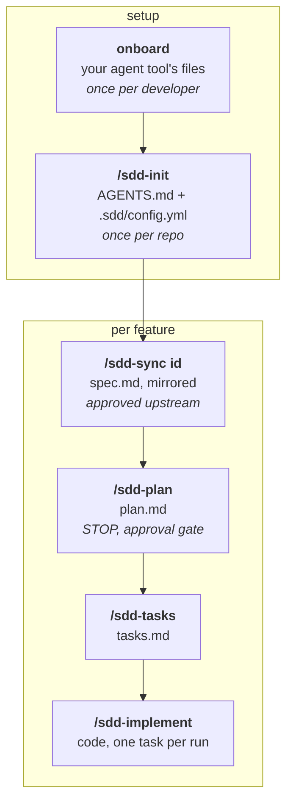
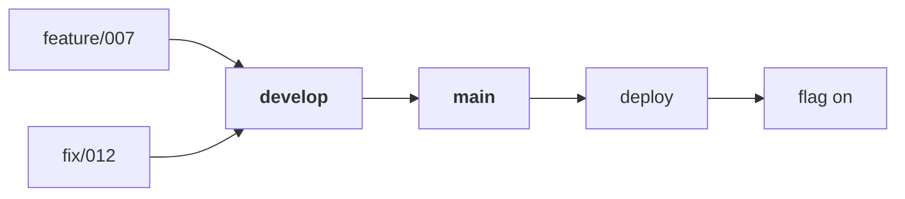
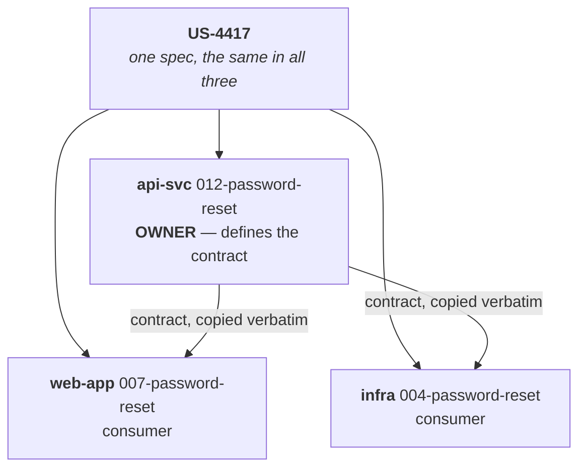

# SDD Project Template — a development repository

[](LICENSE)
[](https://github.com/cabu0124/sdd-project-template/releases)
[](https://github.com/cabu0124/sdd-project-template/generate)

> **Rule 1 — Spec First:** no code without an approved spec.

A starting point for a repository that **builds** the product: frontend,
backend, API, service, worker, mobile, infrastructure. The structure is the same
for all of them; only the placeholders change.

Its specs come from a **Spec Repository** — the product's source of truth for
WHAT and WHY, created from
**[`sdd-spec-template`](https://github.com/cabu0124/sdd-spec-template)** and
shared by every repository that implements it. This one owns the HOW: `plan.md`, `tasks.md` and the code.



A repository with no Spec Repository sets `spec_repo: none` in `.sdd/config.yml`
and writes its own specs with `/sdd-specify`, exactly as before — the loop is
identical either way. Full rules in [`docs/spec-repo.md`](docs/spec-repo.md).

> [!NOTE]
> **This file is for humans. Agents read `AGENTS.md`.**
> It documents *the template*, so `/sdd-init` replaces it with a README for your
> own project, written from `docs/templates/readme.md`.

**Contents**

[The artifacts](#the-artifacts) · [The loop](#the-loop) ·
[The Spec Repository](#the-spec-repository) ·
[Bootstrap a new project](#bootstrap-a-new-project) ·
[Working a feature](#working-a-feature) · [Shipping](#shipping) ·
[Layout](#layout) · [Any agent](#any-agent) ·
[Coming from another spec system](#coming-from-another-spec-system) ·
[Wireframes](#wireframes) · [One US, several repos](#one-us-several-repos) ·
[Why `AGENTS.md` stays under 60 lines](#why-agentsmd-stays-under-60-lines) ·
[License](#license)

---

## The artifacts

Four files per feature, each answering exactly one question:

| Artifact | Answers | Scope |
| --- | --- | --- |
| `spec.md` | **WHAT** the product must do, and why | the product — owned by the Spec Repository, mirrored here read-only |
| `plan.md` | **HOW** *this* repo implements it | this repo |
| `tasks.md` | the ordered, commit-sized units of work | this repo |
| `wireframe.html` | **where things sit** on screen | only features with screens |

## The loop



`/sdd-specify` replaces `/sdd-sync` in a repository that owns its specs
(`spec_repo: none`). Nothing else in the loop changes.

Full sequence, optional steps included:

| # | Command | What it does | Notes |
| --- | --- | --- | --- |
| 1 | `onboard` | Your agent tool's adapter and command files — follow [`docs/commands/onboard.md`](docs/commands/onboard.md) | once per developer |
| 2 | `/sdd-init new\|existing` | Fills `AGENTS.md`, `docs/constitution.md`, `README.md` and `.sdd/config.yml` | once per repo |
| 3 | `/sdd-adopt <path>` | Carries a spec over from a previous system | optional · `spec_repo: none` |
| 4 | `/sdd-sync <id>` | Mirrors a spec in from the Spec Repository | the usual entry point |
| 4b | `/sdd-specify` | WHAT and WHY (+ wireframe, if it has screens) | `spec_repo: none` only |
| 5 | `/sdd-clarify` | Closes what the spec leaves ambiguous | optional · `spec_repo: none` |
| 6 | `/sdd-plan` | HOW this repo builds it — the technical decisions | |
| 7 | `/sdd-tasks` | Ordered, commit-sized units, for this repo only | |
| 8 | `/sdd-analyze` | Cross-checks spec, plan and tasks | optional |
| 9 | `/sdd-implement` | One task per run, then verify | |

> [!IMPORTANT]
> **Two approval gates: after the spec, and after the plan.** The agent stops at
> both, and `/sdd-plan` refuses to run on a spec that is not published —
> `approved`, or `done` if it was delivered before this repository joined. With
> a Spec Repository, the first gate is upstream: the spec arrives already
> approved, or it does not arrive.

**A command is an interactive workflow, not a canned prompt.** Each one:

1. reads the repo and the existing artifacts first,
2. asks only what it cannot work out from them,
3. writes its artifact, and stops.

The workflows live in [`docs/commands/`](docs/commands/), one file per command, and that file is
the whole definition — the per-tool command files are pointers into it, generated
by `onboard`.

They carry the `sdd-` prefix so they never collide with a tool's own commands
(`/init` and `/tasks` are already taken in some agents) and so the whole loop
groups together in autocomplete.

## The Spec Repository

That repository is created from
[`sdd-spec-template`](https://github.com/cabu0124/sdd-spec-template) — the
counterpart to this one. One file — [`.sdd/config.yml`](.sdd/config.yml) —
couples this repository to the product's specs, and it names nothing but a
repository, a ref and a directory:

```yaml
# .sdd/config.yml
spec_repo:
  name: acme-specs
  path: ../acme-specs                        # tried first; needs no network
  remote: git@github.com:acme/acme-specs.git # fallback
  ref: main                                  # a branch to track, or a tag to pin
  specs_dir: specs
  mirror: [spec.md, wireframe.html]
```

`/sdd-sync <id>` resolves `path`, then `remote`, reads the spec at one resolved
commit, copies it into `docs/specs/<NNN-slug>/` **byte for byte**, and writes
`spec.link.yml` beside it — source id, ref, commit, and a `sha256` per file.
That mechanical half is `scripts/spec-sync.sh`, which the command runs rather
than reimplements; what the command adds is the judgement the script refuses to
make — whether a changed requirement invalidates the plan built on it. The copy
is reviewable in a pull request, readable offline, and versioned next to that
plan.

**The mirror is read-only.** Its hashes are checked by `/sdd-sync`,
`/sdd-analyze` and the `spec-mirror` job — all through `scripts/spec-hash.sh`,
so the check never fails on how the digest was taken — and an edit made here
surfaces instead of spreading. A spec that
is wrong, ambiguous or impossible is fixed in the Spec Repository, where the fix
reaches every repository that implements it.

| | Spec Repository | here |
| --- | --- | --- |
| Owns | `spec.md`, `wireframe.html`, status, product docs | `plan.md`, `tasks.md`, the code |
| Numbering | its own `NNN` | its own `NNN`, same slug |
| Answers | WHAT · WHY | HOW · WHERE · WHEN |

Ids need not match — `001-password-reset` upstream can be `007-password-reset`
here — because `spec.link.yml` records the mapping and the slug keeps the story
greppable. Full rules, including `ref` as a pinning policy and what to do about
drift, in [`docs/spec-repo.md`](docs/spec-repo.md) — and a complete run of both
templates together, from writing the spec to shipping the code, in
[`docs/example.md`](docs/example.md).

## Bootstrap a new project

1. **Copy this template** into the new repo.
2. **Set up your agent tool.** Point it at [`docs/commands/onboard.md`](docs/commands/onboard.md) and follow
   it. It asks which tools you use and generates their adapter and `sdd-*`
   command files — all `.gitignore`d. After this, `/sdd-init` and the rest work
   as slash commands. *Each developer does this once.*
3. **Run `/sdd-init new`** if there is no code yet, or **`/sdd-init existing`**
   if there is. It reads what is already there, asks only what it cannot work
   out, fills `AGENTS.md`, `docs/constitution.md` and `.sdd/config.yml` — where
   your Spec Repository is — and replaces this README with one that describes
   your project.
4. **Run `/sdd-sync <spec id>`** to bring in the first spec, or
   `/sdd-specify <what you need>` if this repo owns its specs.

<details>
<summary><b>Prefer to do steps 2–3 by hand?</b> Just as valid — the commands only save you the questions.</summary>

<br>

- **Onboarding** — [`docs/commands/onboard.md`](docs/commands/onboard.md) spells out every file to write.
- **Init** — fill the `<...>` placeholders in **`AGENTS.md` only**, deleting the
  lines that don't apply.
- Fill `.sdd/config.yml` with your Spec Repository, or set `spec_repo: none`.
- Fill or delete `## Project constraints` in `docs/constitution.md`, leaving the
  five principles alone.
- Replace this README with `docs/templates/readme.md` filled in. On an existing
  repo, keep what your own README already said and only add the sections it
  lacked.
- `docs/specs/` ships empty. Specs arrive with `/sdd-sync`, or are written here
  when there is no Spec Repository — delete any directory left over from
  testing the template, but there is no example to remove.

</details>

## Working a feature

| Step | You | Agent |
| --- | --- | --- |
| 1 | `/sdd-sync <id>` — or `/sdd-specify <feature>` when this repo owns its specs | Mirrors `spec.md` (+ `wireframe.html`) from the Spec Repository and records its provenance in `spec.link.yml`, stops |
| 2 | Ambiguity in a mirrored spec | Reported here, answered in the Spec Repository, and re-synced |
| 3 | The spec is published upstream — `approved` | — |
| 4 | `/sdd-plan <NNN>` | Writes `plan.md`, stops |
| 5 | Approve the approach | — |
| 6 | `/sdd-tasks <NNN>` | Writes `tasks.md`, stops |
| 7 | `/sdd-analyze <NNN>` when it earns its keep | Reports what doesn't line up; edits nothing |
| 8 | `/sdd-implement <NNN>`, once per task | One task per run, then verifies the acceptance criteria |

Steps 2 and 7 are optional and meant to be skipped when they'd find nothing.
Every command reads the current state first, so a spec left half-finished resumes
where it stopped instead of starting over.

### Does this change need a spec?

Not every change is a feature:

| Change | What happens |
| --- | --- |
| Typo, dependency bump, edit to the SDD scaffolding itself | Skips the spec |
| Bug fix, copy change, refactor | The agent **asks** whether to spec it, rather than assuming |
| New feature, or any change to WHAT the product does | Spec required |

`Rule 1` in `AGENTS.md` is the triage it follows.

> [!WARNING]
> When implementation reveals the spec was wrong: **stop and update the spec**,
> then continue. Never let the code silently redefine what was agreed.

## Shipping

Two permanent branches, and nothing else:



| Branch | Holds |
| --- | --- |
| `main` | production |
| `develop` | everything integrated, waiting to be promoted |
| `feature/*` `fix/*` `hotfix/*` | one spec's work, deleted on merge |

**There are no release branches.** Work too big for one merge reaches `main`
turned **off** behind a feature flag instead, so deployment and activation are
two separate events — and that separation is the only reason the branching can
stay this short. A release branch is a second `main` you have to keep in step
with the first, and everything people hate about git flow (forward-porting,
cherry-pick trains, versions that drift) is the price of keeping it.

Pull request titles follow Conventional Commits, merges are squashes, and
`.github/workflows/release.yml` derives the next SemVer tag from those titles
and cuts the GitHub Release from `main`. Nobody types a version number.

The flag is a `plan.md` decision and its removal is a task in `tasks.md`, the
same way a mock written against a contract gets its own removal task.

Full rules — the flag pattern, what keeps flags from becoming debt, the two
workflows and the repository settings they assume — in
[`docs/delivery.md`](docs/delivery.md).

## Layout

<details>
<summary><b>The whole repository, file by file</b> — reference, not narrative.</summary>

```text
AGENTS.md              source of truth — the only file loaded every session
README.md              this file — /sdd-init replaces it with your project's own
LICENSE                MIT — replace it in the repository you create
.gitignore             keeps the per-developer agent files out of version control
.sdd/
  config.yml           where the Spec Repository is — the only coupling
.github/
  workflows/           pr-title.yml · release.yml — the delivery model, enforced
                       spec-mirror.yml — the mirrors still match their hashes
docs/
  commands/            the ten workflows, one file per command (incl. onboard)
  constitution.md      durable principles; read when a spec is silent
  delivery.md          branches, feature flags, versioning, releases
  spec-repo.md         how specs are consumed: config, ids, mirror, drift
  templates/           plan.md · tasks.md · spec.link.yml
                       spec.md · wireframe.html — only for repos owning their specs
                       readme.md — the project README, written by /sdd-init
                       cross-repo.md — /sdd-init copies it in for multi-repo products
  specs/
    NNN-slug/  one directory per feature
      spec.md          mirrored, read-only
      spec.link.yml    source id, ref, commit, checksums
      wireframe.html   mirrored, only when the feature has screens
      plan.md          ours
      tasks.md         ours
```

That is the whole repo. `onboard` adds, **outside version control**, the adapter
your tool needs and its `sdd-*` command files.

</details>

Specs are numbered `NNN-slug`, zero-padded, **never reused**. The number is the
permanent id you reference from commits, branches and issues —
`feature/007-password-reset`, `feat(007): …`. See `docs/delivery.md`.

## Any agent

Claude Code, Copilot, Antigravity, Cursor, Codex, Gemini CLI, Windsurf, Zed,
Aider — the method does not care which one you use.

**[`AGENTS.md`](AGENTS.md) is the source of truth.** The template ships nothing tool-specific:
most agents read `AGENTS.md` natively, and the four that need an adapter get a
thin one that points at `AGENTS.md` and repeats only the `Rule 1 — Spec First`
block.

| Tool | Adapter | Command files |
| --- | --- | --- |
| Claude Code | `CLAUDE.md` | `.claude/` |
| Cursor | `.cursor/rules/00-spec-first.mdc` | `.cursor/` |
| GitHub Copilot | `.github/copilot-instructions.md` | `.github/prompts/` |
| Antigravity / Gemini CLI | `GEMINI.md` | `.gemini/` |

Those adapters and the per-tool command files are **generated per developer** by
`docs/commands/onboard.md` and are **`.gitignore`d** — they carry no project
content, so they belong to whoever is using that tool, not to the repo.

> [!TIP]
> A team that *does* want to share one deletes its line from `.gitignore` and
> commits it.

## Coming from another spec system

`/sdd-init existing` reads whatever rules and constitution you already have and
folds them into `AGENTS.md` and `docs/constitution.md`.

Your existing specs are a separate job: **`/sdd-adopt <path>`**, run once per
spec, converts one of them into `docs/specs/NNN-slug/`.

It triages before it converts, and that is the point:

| Spec state | What `/sdd-adopt` does with it |
| --- | --- |
| Already shipped | Archived, rather than back-filled with acceptance criteria nobody wrote |
| Not yet started | Usually better re-run through `/sdd-specify`, with the old document as input |
| **In flight** | The only kind worth converting |

Nothing that is missing from the original gets invented to fill our template.

## Wireframes

A feature with screens gets a fourth artifact: `wireframe.html`, written by
`/sdd-specify` next to `spec.md`. It holds one section per screen, that screen
drawn at each breakpoint side by side, and the empty and error states next to the
happy one.

**It answers where things sit, and nothing else.** Grayscale and hand-drawn on
purpose: a wireframe that looks finished gets reviewed as a design, and the
layout is the part that is still cheap to change. Every element traces back to a
requirement — a control nobody can justify is a hole in the spec, not a detail of
the picture. On any discrepancy **the spec wins** and the wireframe is corrected.

The file opens in any browser straight from disk: no build step, no runtime, no
network.

| Command | Its relationship to the wireframe |
| --- | --- |
| `/sdd-clarify` | Keeps it in step when an answer changes a screen |
| `/sdd-analyze` | Reports where it has drifted |
| `/sdd-implement` | **Does not read it** — implementation follows `plan.md`, or the wireframe quietly becomes a HOW specification |

Projects with no user interface never see any of this: `/sdd-init` records the
answer in `AGENTS.md`, and `/sdd-specify` reads it before writing anything.

## One US, several repos

A product story is often transversal while its code is not. The rule is **one
spec for the product, one plan and one task list per repo** — which is exactly
why the spec lives in its own repository:

- **`spec.md`** — WHAT the product must do, independent of technology and
  repository. The same spec sits in every repo that implements it.
- **`plan.md`** — HOW **this** repo implements it, backend or frontend, and which
  part of the spec it takes.
- **`tasks.md`** — only the tasks needed to implement it **here**.



Same US id and slug everywhere, local `NNN`, contract copied verbatim from the
owning repo. The split between repos is drawn in `plan.md` → `## Scope in this
repo`, so no repo is ever asked to verify a criterion it cannot reach.

Full rules in `docs/cross-repo.md` — `/sdd-init` copies it in from
`docs/templates/` when the product spans repos.

## Why `AGENTS.md` stays under 60 lines

`AGENTS.md` is loaded into context on **every** session and turn — it is the only
file with a permanent cost. Everything else is loaded on demand through the
"Read on demand" table at the bottom of it.

| Guidance needed… | Goes in |
| --- | --- |
| on every task | `AGENTS.md` |
| only on *some* tasks | `docs/`, plus a row in the "Read on demand" table |

When the file grows past ~60 lines, that is the signal something in it belongs in
`docs/` instead.

The adapters make that stricter, not looser. Whatever sits in `AGENTS.md` is paid
for in every tool, on every turn — and each adapter repeats the `Rule 1` block
verbatim, so the budget is the same 60 lines, enforced harder.

## License

MIT — see [`LICENSE`](LICENSE). Copy it, change it, ship it.

A repository created from this template inherits the file. Replace it with your
own: the licence of what you build is your decision, not this template's.
