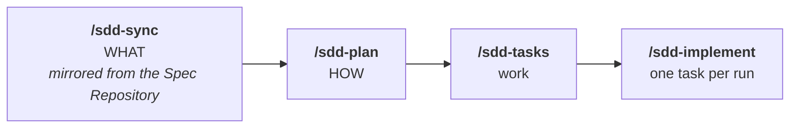

# <project>

<!-- Fill every <...>. Delete the sections you cannot ground in something real —
     a plausible command nobody has run is worse than a missing section.
     Delete this comment when you are done. -->

<!-- Badges. Fill <org>/<repo> and delete the ones you do not want — a badge
     pointing at the wrong repository is worse than no badge at all.
[](https://github.com/<org>/<repo>/actions)
[](https://github.com/<org>/<repo>/releases)
[](LICENSE)
-->

> <One line: what it is and who it is for. The same answer as `AGENTS.md` →
> Project, written for a person who just landed on the repository.>

<A second line only if the first cannot carry it: the problem it solves, or what
makes it different.>

**Status:** <prototype · in development · in production — delete the line if it
is not worth saying.>

---

## Getting started

### Prerequisites

<Runtime versions, services, accounts, credentials — one per line. Delete the
whole subsection if there are none.>

- <...>

### Install and run

```bash
<install>
<run>
```

### Configuration

<Which environment variables must be set and where they come from. Delete the
whole subsection if there are none.>

| Variable | What it is | Where it comes from |
| --- | --- | --- |
| `<VAR>` | <...> | <...> |

## Commands

| Task | Command |
| --- | --- |
| Run | `<cmd>` |
| Test | `<cmd>` |
| Lint | `<cmd>` |
| Build | `<cmd>` |

## Layout

```text
<the two or three directories a newcomer needs, one line each>
docs/specs/            one directory per feature — spec.md (mirrored) · plan.md · tasks.md
```

## Spec first

> [!IMPORTANT]
> **No code without an approved spec.** Specs live in <the Spec Repository —
> name and link it; delete this clause if this repo owns its specs>, and each one
> is mirrored into `docs/specs/NNN-slug/` before any work starts. The agent stops
> for approval **after the plan**.



<!-- Owns its specs instead? Replace /sdd-sync with /sdd-specify above. -->

Trivial changes skip the spec; for a bug fix or a small tweak the agent asks
first rather than assuming.

| Where | What is in it |
| --- | --- |
| `AGENTS.md` | The rules every agent follows |
| `docs/constitution.md` | The durable principles |
| `docs/delivery.md` | Branches, feature flags, releases |
| `docs/commands/` | The workflow behind each command |
| `docs/spec-repo.md` | Where the specs come from, and why the mirror is read-only |
| `.sdd/config.yml` | The Spec Repository: path, remote, ref |
| `docs/specs/NNN-slug/` | One feature: `spec.md` (mirrored) · `plan.md` · `tasks.md` |

> [!TIP]
> **New here?** Set up your agent tool once with `docs/commands/onboard.md` — the
> adapter and command files are generated per developer, not committed.

## Contributing

| | |
| --- | --- |
| Branch from | `develop` — `feature/<NNN>-<slug>` or `fix/<NNN>-<slug>` |
| Pull request title | Conventional Commits — `feat(007): send the reset email` |
| Merge | squash into `develop`; `develop` → `main` promotes to production |
| Release | automatic from `main`: a SemVer tag and a GitHub Release |

Work too large for one merge reaches `main` behind a feature flag, off, and is
switched on afterwards. Full rules in `docs/delivery.md`.

## License

<...>
